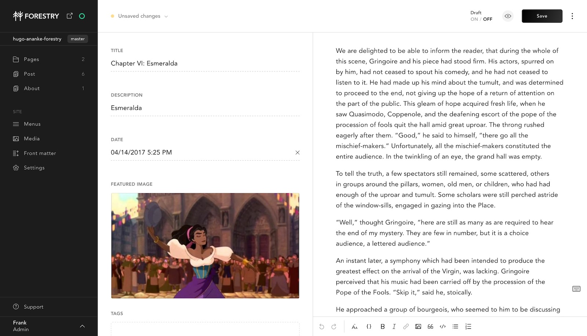

# Hugo Ananke Forestry Starter

Ready-to-use Forestry starter with Hugo Ananke Theme.

[Live Preview](https://gohugo-ananke-theme-demo.netlify.app/)

[Ananke](https://github.com/theNewDynamic/gohugo-theme-ananke) is developed by [The New Dynamic](https://www.thenewdynamic.com/).

## Requirements

- GitHub, GitLab or BitBucket account
- Hugo > 0.56.0

## Content Management



[](https://app.forestry.io/quick-start?repo=forestryio/hugo-ananke-forestry&engine=hugo&version=0.74.3)

This project has been pre-configured to work with [Forestry](https://forestry.io) a git-based CMS, [import this starter in Forestry](https://app.forestry.io/quick-start?repo=forestryio/hugo-ananke-forestry&engine=hugo&version=0.74.3) to be able to edit and preview your site ✨. \

Any changes you make in Forestry will be commited back to the Git repository. Deploy your site on [Vercel](#vercel) or [Netlify](#netlify) within minutes.

## Deployment

### Vercel

[](https://vercel.com/import)

Follow the steps.

### Netlify

[](https://app.netlify.com/start/deploy?repository=https://github.com/forestryio/hugo-ananke-forestry)

1. Set the build command to: `hugo --gc --minify`
2. Set the publish directory to: `public`
3. Make sure to set `HUGO_VERSION` to 0.58.0 or above (tested with 0.74.3)
3. Set the publish directory to: `public`

That's it, now your site gets deployed automatically on `git push` or when saving documents from Forestry.

## Local development

This starter is using [Hugo](https://gohugo.io) as a static site generator.
Once imported in Forestry, clone your repository and develop locally with Hugo.

```bash
# Clone your repository
# Go in the project directory
# Start local dev server
hugo server
```

## Feedback

[See issues](https://github.com/theNewDynamic/gohugo-theme-ananke/issues) in the theme's repository.

## LICENSE

MIT
